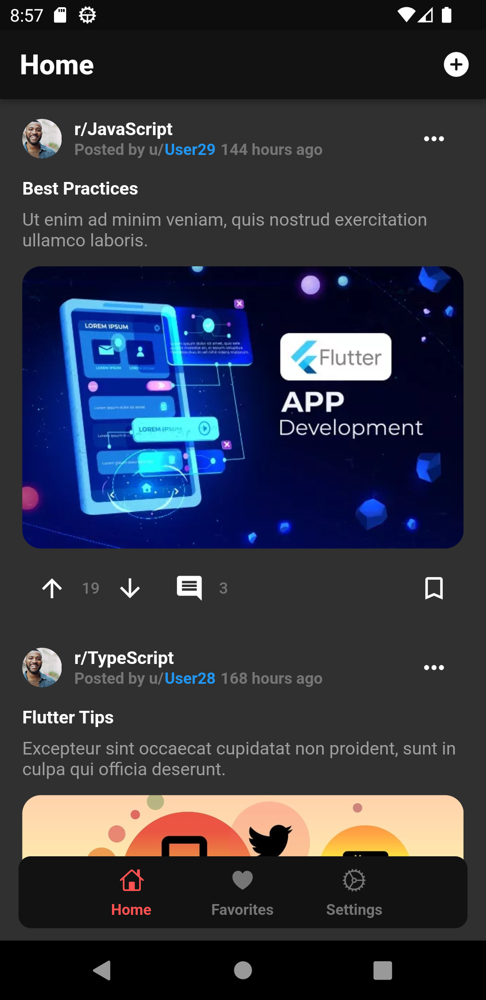
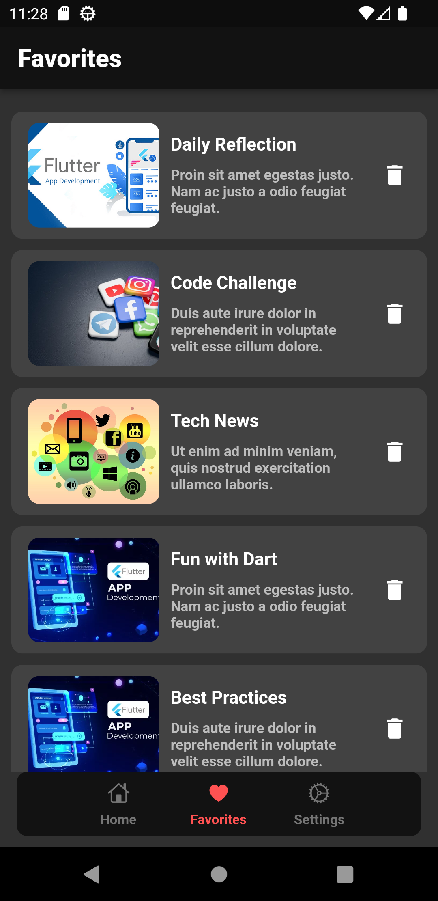
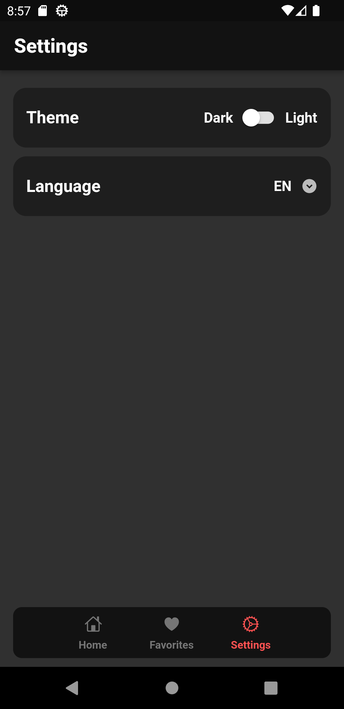
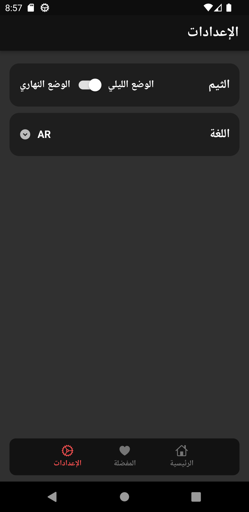
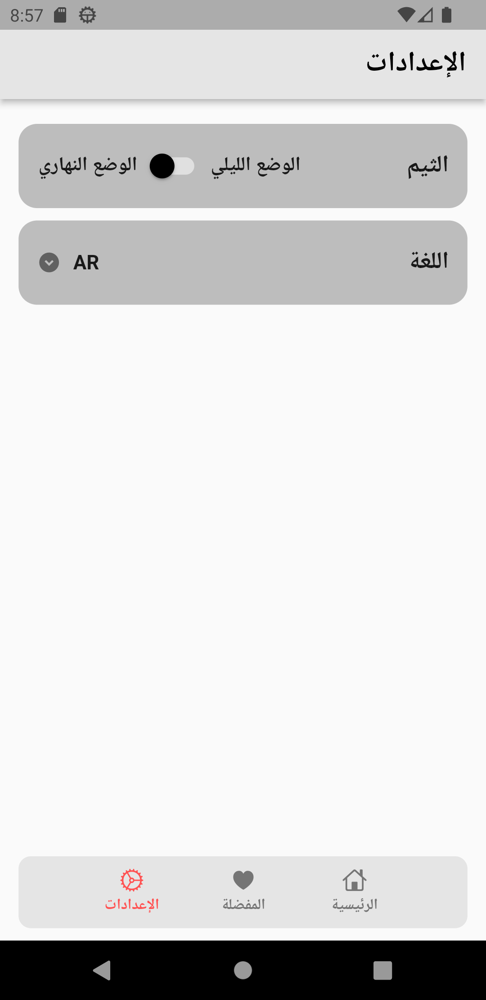
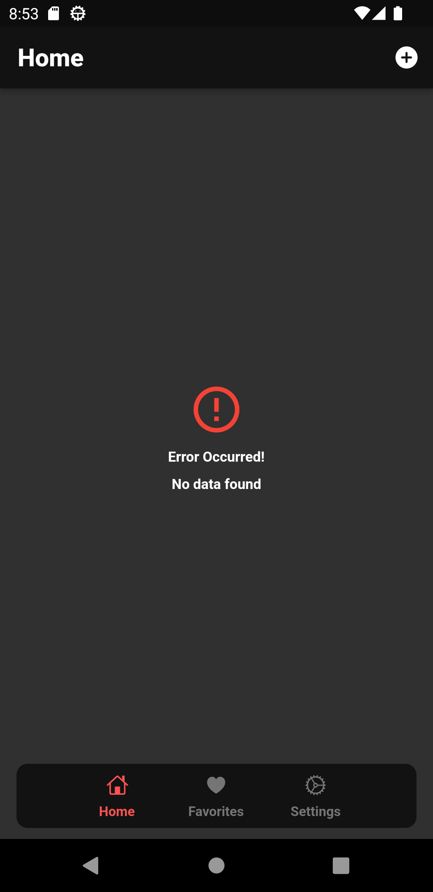

# 🔥 Flutter Reddit Clone App

## ✨ Features :

- Clean Architecture.
- Bloc State Management.
- Firestore Database.
- Connectivity Check.
- Responsive UI.
- Dark Mode.
- Shared Preferences.
- CRUD Operations to handle Favorites.

## 📹 Video Demo : [Flutter Reddit Clone App](https://drive.google.com/file/d/1gMX_fuUPohvimGOewcJ_aiF9LCTMMNVY/view?usp=sharing)

## 📸 Screenshots :

  
  

##